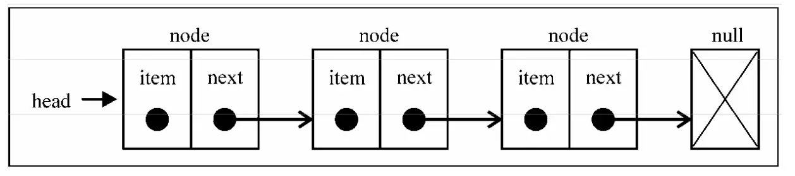
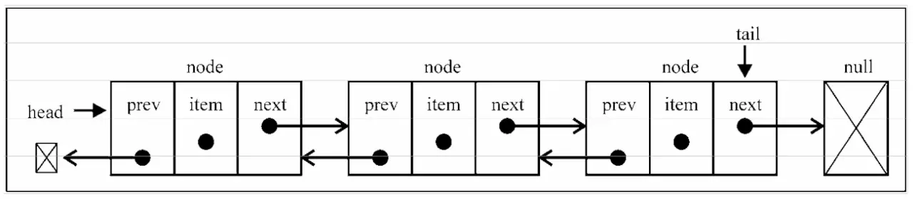

# 数据结构

---

## 1. 栈

栈是一种遵从先进后出 (LIFO) 原则的有序集合；新添加的或待删除的元素都保存在栈的末尾，称作栈顶，另一端为栈底。在栈里，新元素都靠近栈顶，旧元素都接近栈底。

```js
class Stack {
    constructor() {
        this.items = [];
    }

    // 入栈
    push(element) {
        this.items.push(element);
    }

    // 出栈
    pop() {
        return this.items.pop();
    }

    // 末位
    get peek() {
        return this.items[this.items.length - 1];
    }

    // 是否为空栈
    get isEmpty() {
        return !this.items.length;
    }

    // 尺寸
    get size() {
        return this.items.length;
    }

    // 清空栈
    clear() {
        this.items = [];
    }

    // 打印栈数据
    print() {
        console.log(this.items.toString());
    }
}

// 实例化一个栈
const stack = new Stack();
console.log(stack.isEmpty); // true

// 添加元素
stack.push(5);
stack.push(8);

// 读取属性再添加
console.log(stack.peek); // 8
stack.push(11);
console.log(stack.size); // 3
console.log(stack.isEmpty); // false
```

## 2. 队列

与栈相反，队列是一种遵循先进先出 (FIFO / First In First Out) 原则的一组有序的项；队列在尾部添加新元素，并从头部移除元素。最新添加的元素必须排在队列的末尾。

```js
class Queue {
    constructor(items) {
        this.items = items || [];
    }
    // 排队
    enqueue(element) {
        this.items.push(element);
    }
    // 离队
    dequeue() {
        return this.items.shift();
    }
    // 第一位
    front() {
        return this.items[0];
    }
    // 清除队列
    clear() {
        this.items = [];
    }
    // 获取队列长度
    get size() {
        return this.items.length;
    }
    // 队列是否为空
    get isEmpty() {
        return !this.items.length;
    }
    // 打印整个队列
    print() {
        console.log(this.items.toString());
    }
}

const queue = new Queue();
console.log(queue.isEmpty); // true

queue.enqueue("John");
queue.enqueue("Jack");
queue.enqueue("Camila");
console.log(queue.size); // 3
console.log(queue.isEmpty); // false
queue.dequeue();
queue.dequeue();
queue.print(); // 'Camila'
```

## 3. 链表

要存储多个元素，数组（或列表）可能是最常用的数据结构。每种语言都实现了数组。

这种数据结构非常方便，提供了一个便利的[]语法来访问它的元素。

然而，这种数据结构有一个缺点：在大多数语言中，数组的大小是固定的，从数组的起点或中间插入或移除项的成本很高，因为需要移动元素；

链表存储有序的元素集合，但不同于数组，链表中的元素在内存中并不是连续放置的。每个 元素由一个存储元素本身的节点和一个指向下一个元素的引用(也称指针或链接)组成。下图展示了链表的结构:

相对于传统的数组，链表的一个好处在于，添加或移除元素的时候不需要移动其他元素。然而，链表需要使用指针，因此实现链表时需要额外注意。

数组的另一个细节是可以直接访问任何位置的任何元素，而要想访问链表中间的一个元素，需要从起点(表头)开始迭代列表直到找到所需的元素。

**单向链表**



```js
// 单向链表
class Node {
    constructor(element) {
        this.element = element; //当前节点的元素
        this.next = null; //下一个节点链接
    }
}

class linkTable {
    constructor() {
        this.head = new Node("head");
    }
    // 寻找节点
    find(item) {
        var currNode = this.head;
        while (currNode.element != item) {
            currNode = currNode.next;
        }
        return currNode;
    }
    // 在 item 之后插入 newElement 节点
    insert(newElement, item) {
        var newNode = new Node(newElement);
        var currNode = this.find(item);
        newNode.next = currNode.next;
        currNode.next = newNode;
    }
    // 显示链表
    display() {
        var currNode = this.head;
        while (currNode.next !== null) {
            console.log(currNode.next.element);
            console.log(t);
            currNode = currNode.next;
        }
    }
    // 找前一个
    findPrev(item) {
        var currNode = this.head;
        while (!(currNode.next == null) && currNode.next.element != item) {
            currNode = currNode.next;
        }
        return currNode;
    }
    // 移除
    remove(item) {
        var prevNode = this.findPrev(item);
        if (!(prevNode.next == null)) {
            prevNode.next = prevNode.next.next;
        }
    }
}
var fruits = new linkTable();

fruits.insert("Apple", "head");
fruits.insert("Banana", "Apple");
fruits.insert("Pear", "Banana");
console.log(fruits);
```

**双向链表**

双向链表和普通链表的区别在于，在链表中， 一个节点只有链向下一个节点的链接，而在双向链表中，链接是双向的:一个链向下一个元素， 另一个链向前一个元素，如下图所示:



```js
// 链表节点
class Node {
    constructor(element) {
        this.element = element;
        this.prev = null;
        this.next = null;
    }
}

// 双向链表
class DoublyLinkedList {
    constructor() {
        this.head = null;
        this.tail = null;
        this.length = 0;
    }

    // 任意位置插入元素
    insert(position, element) {
        if (position >= 0 && position <= this.length) {
            const node = new Node(element);
            let current = this.head;
            let previous = null;
            let index = 0;
            // 首位
            if (position === 0) {
                if (!head) {
                    this.head = node;
                    this.tail = node;
                } else {
                    node.next = current;
                    this.head = node;
                    current.prev = node;
                }
                // 末位
            } else if (position === this.length) {
                current = this.tail;
                current.next = node;
                node.prev = current;
                this.tail = node;
                // 中位
            } else {
                while (index++ < position) {
                    previous = current;
                    current = current.next;
                }
                node.next = current;
                previous.next = node;
                current.prev = node;
                node.prev = previous;
            }
            this.length++;
            return true;
        }
        return false;
    }

    // 移除指定位置元素
    removeAt(position) {
        if (position > -1 && position < this.length) {
            let current = this.head;
            let previous = null;
            let index = 0;

            // 首位
            if (position === 0) {
                this.head = this.head.next;
                this.head.prev = null;
                if (this.length === 1) {
                    this.tail = null;
                }

                // 末位
            } else if (position === this.length - 1) {
                this.tail = this.tail.prev;
                this.tail.next = null;

                // 中位
            } else {
                while (index++ < position) {
                    previous = current;
                    current = current.next;
                }
                previous.next = current.next;
                current.next.prev = previous;
            }
            this.length--;
            return current.element;
        } else {
            return null;
        }
    }

    // 其他方法...
}
```

链表相比数组最重要的优点，那就是无需移动链表中的元素，就能轻松地添加和移除元素。因此，当你需要添加和移除很多元素 时，最好的选择就是链表，而非数组。

## 4. 集合

集合是由一组无序且唯一（不能重复）的项组成的。这个数据结构使用了与有限集合相同的数学概念，但应用在计算机科学的数据结构中。

对集合可以进行如下操作：

-   并集：对于给定的两个集合，返回一个包含两个集合中所有元素的新集合。
-   交集：对于给定的两个集合，返回一个包含两个集合中 Р 有元素的新集合。
-   差集：对于给定的两个集合，返回一个包含所有存在于第一个集合且不存在于第二个集合的元素的新集合。
-   子集：求证一个给定集合是否是另一集合的子集。

目前 ES6 中已内置了 Set 类型的实现，出于学习目的，下面我们依旧使用 Javascript 创建一个集合类：

```js
class Set {
    constructor() {
        this.items = {};
    }

    has(value) {
        return this.items.hasOwnProperty(value);
    }

    add(value) {
        if (!this.has(value)) {
            this.items[value] = value;
            return true;
        }
        return false;
    }

    remove(value) {
        if (this.has(value)) {
            delete this.items[value];
            return true;
        }
        return false;
    }
    // 并集
    union(otherSet) {
        const unionSet = new Set();
        this.values.forEach((v, i) => unionSet.add(this.values[i]));
        otherSet.values.forEach((v, i) => unionSet.add(otherSet.values[i]));
        return unionSet;
    }
    // 交集
    intersection(otherSet) {
        const intersectionSet = new Set();
        this.values.forEach((v, i) => {
            if (otherSet.has(v)) {
                intersectionSet.add(v);
            }
        });
        return intersectionSet;
    }
    // 差集，A-B 存在于A中且不存在与B中
    difference(otherSet) {
        const differenceSet = new Set();
        this.values.forEach((v, i) => {
            if (!otherSet.has(v)) {
                differenceSet.add(v);
            }
        });
        return differenceSet;
    }
    // 子集，A 包含于 B
    subset(otherSet) {
        if (this.size > otherSet.size) {
            return false;
        } else {
            return !this.values.some(v => !otherSet.has(v));
        }
    }
    get size() {
        return Object.keys(this.items).length;
    }

    get values() {
        return Object.keys(this.items);
    }
}

const set = new Set();
set.add(1);
console.log(set.values); // ["1"]
console.log(set.has(1)); // true
console.log(set.size); // 1
set.add(2);
console.log(set.values); // ["1", "2"]
console.log(set.has(2)); // true
console.log(set.size); // 2
set.remove(1);
console.log(set.values); // ["2"]
set.remove(2);
console.log(set.values); // []
```

## 5. 字典

集合、字典、散列表都可以存储不重复的数据。字典和我们上面实现的集合很像，上面的集合中我们以`{ value: value }`的形式存储数据，而字典是以`{ key: value }`的形式存储数据，字典也称作映射。

简单说：Object 对象便是字典在 Javascript 中的实现。

```js
class Dictionary {
    constructor() {
        this.items = {};
    }

    set(key, value) {
        this.items[key] = value;
    }

    get(key) {
        return this.items[key];
    }

    remove(key) {
        delete this.items[key];
    }

    get keys() {
        return Object.keys(this.items);
    }

    get values() {
        /*

        也可以使用ES7中的values方法

        return Object.values(this.items)

        */

        // 在这里我们通过循环生成一个数组并输出
        return Object.keys(this.items).reduce((r, c, i) => {
            r.push(this.items[c]);
            return r;
        }, []);
    }
}
const dictionary = new Dictionary();
dictionary.set("Gandalf", "gandalf@email.com");
dictionary.set("John", "johnsnow@email.com");
dictionary.set("Tyrion", "tyrion@email.com");

console.log(dictionary);
console.log(dictionary.keys);
console.log(dictionary.values);
console.log(dictionary.items);
```

## 6. 二叉树

二叉树中的节点最多只能有两个子节点：一个是左侧子节点，另一个是右侧子节点。这些定 义有助于我们写出更高效的向/从树中插人、查找和删除节点的算法。二叉树在计算机科学中的 应用非常广泛。

二叉搜索树（BST）是二叉树的一种，但是它只允许你在左侧节点存储（比父节点）小的值， 在右侧节点存储（比父节点）大（或者等于）的值。上图中就展现了一棵二叉搜索树。


```js
class Node {
    constructor(key) {
        this.key = key;
        this.left = null;
        this.right = null;
    }
}

class BinarySearchTree {
    constructor() {
        this.root = null;
    }

    insert(key) {
        const newNode = new Node(key);
        const insertNode = (node, newNode) => {
            if (newNode.key < node.key) {
                if (node.left === null) {
                    node.left = newNode;
                } else {
                    insertNode(node.left, newNode);
                }
            } else {
                if (node.right === null) {
                    node.right = newNode;
                } else {
                    insertNode(node.right, newNode);
                }
            }
        };
        if (!this.root) {
            this.root = newNode;
        } else {
            insertNode(this.root, newNode);
        }
    }
    min(node) {
        const minNode = node => {
            return node ? (node.left ? minNode(node.left) : node) : null;
        };
        return minNode(node || this.root);
    }

    max(node) {
        const maxNode = node => {
            return node ? (node.right ? maxNode(node.right) : node) : null;
        };
        return maxNode(node || this.root);
    }
    search(key) {
        const searchNode = (node, key) => {
            if (node === null) return false;
            if (node.key === key) return node;
            return searchNode(key < node.key ? node.left : node.right, key);
        };
        return searchNode(this.root, key);
    }

    remove(key) {
        const removeNode = (node, key) => {
            if (node === null) return false;
            if (node.key === key) {
                console.log(node);
                if (node.left === null && node.right === null) {
                    let _node = node;
                    node = null;
                    return _node;
                } else {
                    console.log("key", key);
                }
            } else if (node.left !== null && node.key > key) {
                if (node.left.key === key) {
                    node.left.key = this.min(node.left.right).key;
                    removeNode(node.left.right, node.left.key);
                    return node.left;
                } else {
                    return removeNode(node.left, key);
                }
            } else if (node.right !== null && node.key < key) {
                if (node.right.key === key) {
                    node.right.key = this.min(node.right.right).key;
                    removeNode(node.right.right, node.right.key);
                    return node.right;
                } else {
                    return removeNode(node.right, key);
                }
            } else {
                return false;
            }
            return removeNode(key < node.key ? node.left : node.right, key);
        };
        return removeNode(this.root, key);
    }
}

const tree = new BinarySearchTree();
tree.insert(11);
tree.insert(7);
tree.insert(5);
tree.insert(3);
tree.insert(9);
tree.insert(8);
tree.insert(10);
tree.insert(13);
tree.insert(12);
tree.insert(14);
tree.insert(20);
tree.insert(18);
tree.insert(25);
```

最终构建的树如下图：


