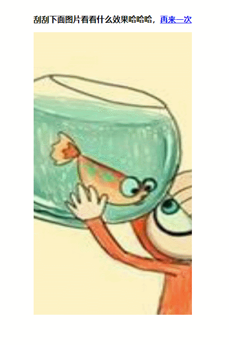

# 实现一个“刮刮乐”游戏

## 1. 背景
之前公司项目有一个刮奖小游戏的需求，因此有了本文记录该“刮刮乐”游戏的实现过程。

话不多说，先上 [Demo](https://zxpsuper.github.io/Demo/letter/) 和 [项目源码](https://github.com/zxpsuper/Demo/blob/master/letter/scrapAward-dev.js).




## 2. 实现

我们创建一个 `ScrapAward` 类，通过传入 `option` 和调用其 `restart()` 方法实现重新开始。

### （1）定义 `option` 参数及 `ScrapAward` 结构

```js
class ScrapAward {
    constructor(userOption) {
        this.option = {
            canvasId: 'canvas', // canvas的id
            backgroundImageUrl: '', // 背景图url
            width: 320, // canvas宽度
            height: 160, // canvas高度
            backgroundSize: '100% 100%',
            coverImage: { // 覆盖图层背景图url
                url: '',
                width: 320,
                height: 160,
            },
            callback: () => {}, // 刮奖完成的回调函数
        };
        this.ctx = null;
        this.init(userOption); // 初始化
    }
    // 初始化方法
    init(userOption) {
    }
    // 重新开始也是一次初始化
    restart(userOption) {
        if (userOption) {
            this.init(userOption);
        } else {
            this.init({});
        }
    }
}
```
### （2）`init` 初始化

首先合并用户的配置 `userOption` 和默认 `option`, 等背景图片加载完成后调用 `fillCanvas()` 方法绘制覆盖层的图片后设置 `canvas` 的背景图。

当上述行为完成后，我们便监听鼠标或者touch事件。刮奖这一行为其实是canvas对鼠标或者touch的移动路径进行绘画，只不过是将绘画的路径变成了透明，这种效果我们通过设置 `ctx.globalCompositeOperation = 'destination-out';` 即可实现。

```js
init(userOption) {
        // 合并用户配置
        if (Object.assign) {
            Object.assign(this.option, userOption);
        } else {
            extend(this.option, userOption, true);
        }
        // 定义一系列变量
        let that = this,
            img = (this.img = new Image()), //背景图片
            imgLoaded = false, //背景图是否加载完成
            canvas = (this.canvas = document.querySelector(`#${this.option.canvasId}`)),
            hastouch = 'ontouchstart' in window ? true : false,
            tapstart = hastouch ? 'touchstart' : 'mousedown',
            tapmove = hastouch ? 'touchmove' : 'mousemove',
            tapend = hastouch ? 'touchend' : 'mouseup',
            coverImg = (this.coverImg = new Image()),
            hasDone = false, // 是否刮奖完毕
            coverImgLoad = false;

        that.mousedown = false; //鼠标的mousedown事件或者touchmove事件是否开启
        
        // 移除事件监听，用于重新开始
        if (this.canvas) {
            this.canvas.removeEventListener(tapstart, eventDown);
            this.canvas.removeEventListener(tapend, eventUp);
            this.canvas.removeEventListener(tapmove, eventMove);
        }
        
        coverImg.src = this.option.coverImage.url;
        coverImg.crossOrigin = 'Anonymous'; // 解决一些跨域问题

        img.src = this.option.backgroundImageUrl;

        var w = (img.width = this.option.width),
            h = (img.height = this.option.height);
        this.canvasOffsetX = canvas.offsetLeft;
        this.canvasOffsetY = canvas.offsetTop;
        canvas.width = w;
        canvas.height = h;

        this.ctx = canvas.getContext('2d');
        let ctx = this.ctx;
        this.img.addEventListener('load', backgroundImageLoaded);
        this.option.coverImage.url && this.coverImg.addEventListener('load', coverImageLoaded);
        
        
        // 背景图片加载完成后
        function backgroundImageLoaded(e) {
            imgLoaded = true;
            fillCanvas();
            canvas.style.background = 'url(' + img.src + ') no-repeat';
            canvas.style.backgroundSize = that.option.backgroundSize || 'contain';
        }
        // 覆蓋图片加载完成后
        function coverImageLoaded(e) {
            coverImgLoad = true;
            fillCanvas();
            canvas.style.background = 'url(' + img.src + ') no-repeat';
            canvas.style.backgroundSize = that.option.backgroundSize || 'contain';
        }
        // 绘制canvas
        function fillCanvas() {
            if (that.option.coverImage.url && (!imgLoaded || !coverImgLoad)) return;
            if (!that.option.coverImage.url) {
                ctx.fillStyle = that.option.coverImage.color || 'gray';
                ctx.fillRect(0, 0, w, h);
            } else {
                ctx.drawImage(coverImg, 0, 0, that.option.coverImage.width, that.option.coverImage.height);
            }
            ctx.globalCompositeOperation = 'destination-out';
            canvas.addEventListener(tapstart, eventDown);
            canvas.addEventListener(tapend, eventUp);
            canvas.addEventListener(tapmove, eventMove);
        }
        // 点击开始事件
        function eventDown(e) {
            e.preventDefault();
            that.mousedown = true;
        }
        // 点击结束事件
        function eventUp(e) {
            e.preventDefault();
            that.mousedown = false;
        }
        // 刮奖事件
        function eventMove(e) {
            if (hasDone) return; // 刮奖结束则return
            let ctx = that.ctx;
            e.preventDefault();
            if (that.mousedown) {
                if (e.changedTouches) {
                    e = e.changedTouches[0];
                }
                var x = (e.clientX + document.body.scrollLeft || e.pageX) - that.canvasOffsetX || 0,
                    y = (e.clientY + document.body.scrollTop || e.pageY) - that.canvasOffsetY || 0;

                ctx.beginPath();
                ctx.arc(x, y, 20, 0, Math.PI * 2);
                ctx.fill();
            }
        }
    }
```

### （3）刮奖完毕的实现

上述代码实现刮奖的效果，但是一般的场景是用户刮奖的面积超过一半时，覆盖图层全部散开，此时为刮奖完成的状态。

如何知道刮奖的面积超过一半了呢？`canvas` 中的 `ctx` 对象提供了一个方法 `getImageData()`, 该方法可返回某个区域内每个像素点的数值的组成的数组，数组中4个元素表示一个像素点的rgba值。

因此我们可以判断 `rgba` 中的 `a` 值透明度，透明度小于 `256` 的一半（`128`）即可视为透明状态，计算透明 `a` 值的百分比.

判断 `a` 值百分比大于 `50`, 则调用 `ctx.clearRect(0, 0, w, h);` 清除画布, 并执行成功回调 `callback`.

```js
function eventMove(e) {
    if (hasDone) return; // 刮奖结束则return
    let ctx = that.ctx;
    e.preventDefault();
    if (that.mousedown) {
        if (e.changedTouches) {
            e = e.changedTouches[0];
        }
        var x = (e.clientX + document.body.scrollLeft || e.pageX) - that.canvasOffsetX || 0,
            y = (e.clientY + document.body.scrollTop || e.pageY) - that.canvasOffsetY || 0;

        ctx.beginPath();
        ctx.arc(x, y, 20, 0, Math.PI * 2);
        ctx.fill();
    }
    handleFilledPercentage(getFilledPercentage());
}
// 计算已经刮过的区域占整个区域的百分比
function getFilledPercentage() {
    let imgData = that.ctx.getImageData(0, 0, w, h);
    // imgData.data是个数组，存储着指定区域每个像素点的信息，数组中4个元素表示一个像素点的rgba值
    let pixels = imgData.data;
    let transPixels = [];
    for (let i = 0; i < pixels.length; i += 4) {
        // 严格上来说，判断像素点是否透明需要判断该像素点的a值是否等于0，
        // 为了提高计算效率，这儿设置当a值小于128，也就是半透明状态时就可以了
        if (pixels[i + 3] < 128) {
            transPixels.push(pixels[i + 3]);
        }
    }
    return ((transPixels.length / (pixels.length / 4)) * 100).toFixed(2) + '%';
}
// 设置阈值，去除灰色涂层
function handleFilledPercentage(percentage) {
    percentage = percentage || 0;
    if (parseInt(percentage) > 50) {
        // 当像素点的个数超过  50% 时，清空画布，显示底图
        ctx.clearRect(0, 0, w, h);
        hasDone = true;
        that.option.callback();
    }
}
```

## 3. 使用

将代码引入 `html` 后，新建 `new scraAward(option)` 即可实现。页面结构如下：

```html
<!DOCTYPE html>
<html lang="en">
    <head>
        <meta charset="UTF-8" />
        <meta name="viewport" content="width=device-width, initial-scale=1.0" />
        <meta http-equiv="X-UA-Compatible" content="ie=edge" />
        <title>实现一个“刮刮乐”游戏</title>
        <style type="text/css">
            .demo {
                width: 320px;
                margin: 10px auto 20px auto;
                min-height: 300px;
            }
            .msg {
                text-align: center;
                height: 32px;
                line-height: 32px;
                font-weight: bold;
                margin-top: 50px;
            }
        </style>
    </head>
    <body>
        <div id="main">
            <div class="msg">
                刮刮下面图片看看什么效果哈哈哈，<a href="javascript:void(0)" id="try_again">再来一次</a>
            </div>
            <div class="demo">
                <canvas id="canvas"></canvas>
            </div>
        </div>
        <script src="./scrapAward-dev.js"></script>
        <script>
            window.onload = function() {
                let scraAward = new ScrapAward({
                    height: 570,
                    backgroundImageUrl: './suporka_home.jpg',
                    coverImage: {
                        url: './super.jpg',
                        // color: 'red',
                        width: 428,
                        height: 570,
                    },
                    callback: () => {
                        alert('刮奖结束');
                    },
                });
                document.getElementById('try_again').addEventListener('click', function(e) {
                    scraAward.restart();
                });
            };
        </script>
    </body>
</html>

```

## 总结

本案例主要是对 `canvas` 的 `ctx.getImageData` 及 `ctx.globalCompositeOperation = 'destination-out';` 的运用实现我们想要的效果。后续还有 `canvas` 系列的相关文章，敬请期待！


## 更多推荐

[前端进阶小书（advanced_front_end）](https://github.com/zxpsuper/advanced_front_end)

[前端每日一题（daily-question）](https://github.com/zxpsuper/daily-question)

[webpack4 搭建 Vue 应用（createVue）](https://github.com/zxpsuper/createVue)

[Canvas 进阶（一）二维码的生成与扫码识别](https://segmentfault.com/a/1190000019461615)

[Canvas 进阶（二）写一个生成带logo的二维码npm插件](https://juejin.im/post/5d1c461f6fb9a07f070e4768)

[Canvas 进阶（三）ts + canvas 重写”辨色“小游戏](https://juejin.im/post/5d22af2b6fb9a07ea7133361)

